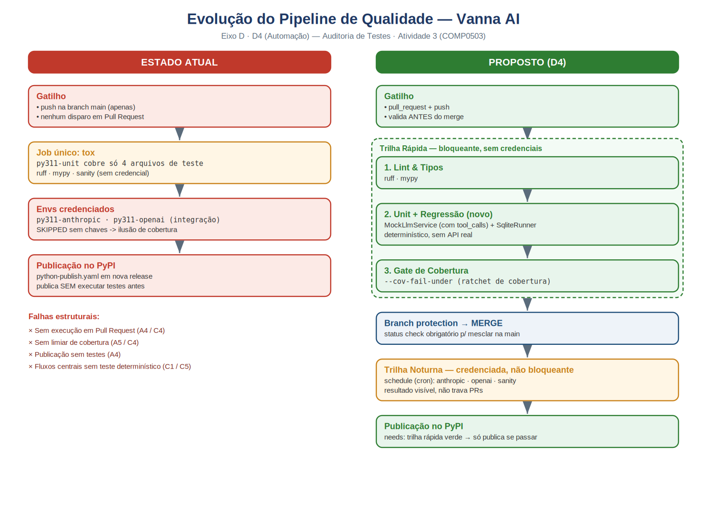

# Diagrama — Evolução do Pipeline de Qualidade (Eixo D · D4)

## O que o diagrama representa

Comparação entre o **estado atual** do pipeline de testes do Vanna AI e o **modelo proposto** no item D4 (Automação) do plano de evolução da qualidade.

### Estado atual
* Gatilho apenas em `push` na branch `main` — nenhuma validação em Pull Request.
* Job único de `tox`: `py311-unit` cobre só 4 arquivos; envs credenciados são **ignorados (skipped)** sem chaves de API, gerando uma "ilusão de cobertura".
* Publicação no PyPI (`python-publish.yaml`) ocorre **sem executar testes** antes.

### Proposto (D4)
* **Trilha Rápida** (bloqueante, sem credenciais): lint/tipos → testes unitários + de regressão determinísticos (`MockLlmService` + `SqliteRunner`) → gate de cobertura (`--cov-fail-under`). É o status check obrigatório para merge via *branch protection*.
* **Trilha Noturna** (credenciada, não bloqueante): integração com provedores e *sanity* via `schedule`, sem travar PRs.
* Publicação no PyPI condicionada (`needs:`) à trilha rápida verde.

## Rastreabilidade
* *Referência no Doc Final:* Eixo D, item D4 (Automação).
* Evidências relacionadas: `evidencias/evidencias_eixo_c_lacunas.md` e `evidencias/evidencias_eixo_d_plano.md`.

## Arquivos
* `diagrama_pipeline_d4.png` — imagem para inserir no relatório/slides.
* `diagrama_pipeline_d4.svg` — versão vetorial (editável / alta resolução).
